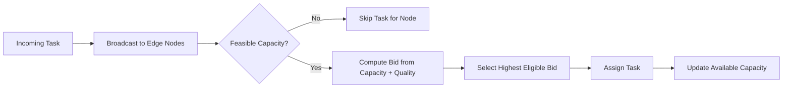
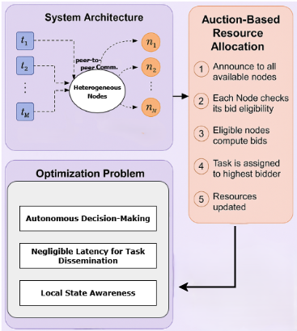
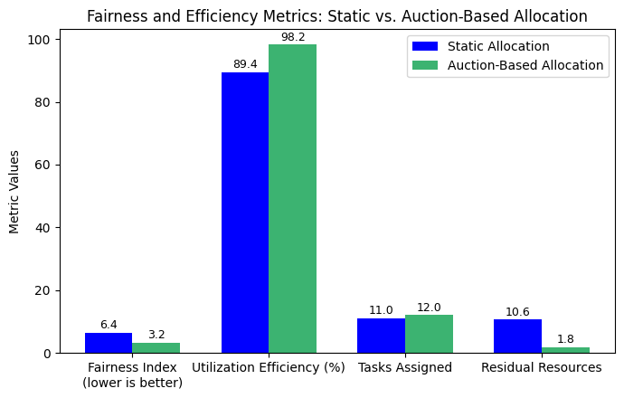

# Auction-Based Dynamic Resource Allocation for Optimized Edge Computing in Distributed Networks

## IEEE Research Artifact for Distributed Edge Computing

[](docs/assets/papers/distributed-networks-ieee-paper.pdf)
[](https://ieeexplore.ieee.org/abstract/document/11294238)
[](docs/index.html)
[](https://youtu.be/F9P6sYJBts0)
[](https://ieeexplore.ieee.org/abstract/document/11294238)

This repository is a rebuilt research artifact for the published IEEE paper:

> **Auction-Based Dynamic Resource Allocation for Optimized Edge Computing in Distributed Networks**

The project is structured as a GitHub Pages-ready research portal with:

- a polished website in [`docs/`](docs/index.html)
- an extended HTML report in [`docs/report.html`](docs/report.html)
- a poster-style summary in [`docs/poster.html`](docs/poster.html)
- the local paper PDF in [`docs/assets/papers/distributed-networks-ieee-paper.pdf`](docs/assets/papers/distributed-networks-ieee-paper.pdf)
- a paper-grounded analytics layer in [`docs/assets/data/research-data.json`](docs/assets/data/research-data.json)

The rebuild is based on the local project materials in this directory, especially the PDF paper, and does **not** invent unsupported metrics or claims.

---

## Research Portal

- Repository-local portal: [`docs/index.html`](docs/index.html)
- Repository-local report: [`docs/report.html`](docs/report.html)
- Repository-local poster: [`docs/poster.html`](docs/poster.html)
- Expected GitHub Pages URL after deployment: <https://anis151993.github.io/Distributed-Networks/>
- Video walkthrough: <https://youtu.be/F9P6sYJBts0>
- IEEE Xplore entry: <https://ieeexplore.ieee.org/abstract/document/11294238>
- Google Scholar reference: <https://scholar.google.com/citations?view_op=view_citation&hl=en&user=NQyywPoAAAAJ&citation_for_view=NQyywPoAAAAJ:bEWYMUwI8FkC>

---

## Project Overview

Edge computing environments have to place computation under changing task arrivals, finite node capacity, and heterogeneous hardware. This paper proposes a decentralized sealed-bid auction mechanism where feasible nodes bid using residual capacity and performance quality. The reported outcome is stronger resource utilization, lower fragmentation, full task placement, and better fairness than a static first-fit baseline.

### Publication context

| Field | Value |
|---|---|
| Conference | 2025 9th International Conference on Computational System and Information Technology for Sustainable Solutions (CSITSS) |
| Publication date | November 20, 2025 |
| Primary researcher | Md Anisur Rahman Chowdhury |
| Runtime setting | Ubuntu 22.04, Intel Core i7-12700, 32 GB RAM |
| Experiment scale | 5 heterogeneous nodes, 12 tasks, 20 randomized trials |

---

## Research Motivation

- Static placement in distributed edge networks can leave small fragments of idle capacity across nodes, causing avoidable task rejection.
- Auction logic gives nodes a decentralized decision rule that reacts to local state instead of relying on a central controller.
- The paper targets edge scenarios where latency, fairness, and resource efficiency matter at the same time, including IoT and smart-city deployments.

---

## Key Contributions

- A fully decentralized allocation framework that reduces reliance on central coordination.
- A flexible bid metric that combines residual capacity and node quality.
- A lightweight sealed-bid assignment procedure with reported `O(M · N)` complexity.
- A paper-grounded web artifact that exposes the paper, figures, tables, and derived analytics in a GitHub Pages-friendly format.

---

## Methodology Summary



The paper models task placement as an optimization problem with capacity constraints and one-task-one-node assignment rules, then operationalizes it as a sealed-bid auction over feasible nodes.

---

## Architecture Snapshot



The website keeps the original architecture figure and complements it with web-native explanations of the bidding steps, optimization objective, and scaling behavior.

---

## Results Highlights

| Metric | Static allocation | Auction-based allocation |
|---|---:|---:|
| Resource utilization rate | 89.4% | **98.2%** |
| Task assignment rate | 91.7% | **100%** |
| Residual fragmentation | 10.6 units | **1.8 units** |
| Fairness index | 6.4 | **3.2** |
| Tasks successfully placed | 11 / 12 | **12 / 12** |



The portal also includes the original task-allocation and resource-usage figures extracted from the PDF:

- [`docs/assets/images/task-allocation-comparison-paper.png`](docs/assets/images/task-allocation-comparison-paper.png)
- [`docs/assets/images/resource-utilization-paper.png`](docs/assets/images/resource-utilization-paper.png)
- [`docs/assets/images/remaining-resources-paper.png`](docs/assets/images/remaining-resources-paper.png)
- [`docs/assets/images/task-volume-efficiency-paper.png`](docs/assets/images/task-volume-efficiency-paper.png)

---

## Visual Analytics

The GitHub Pages portal adds six analytics views requested for the repository, all grounded in the local paper data.

| Plot | Data basis | What it shows |
|---|---|---|
| DistPlot | Table I task demand values | Distribution of workload intensity across the 12 tasks |
| Pie chart | Task demand values grouped by class | Share of resource demand carried by small, medium, and large tasks |
| ViolinPlot | Figure-derived representative node usage values | Spread of per-node loading under static vs. auction allocation |
| HeatMap | Reported task-to-node mappings | Placement matrix for each task across both strategies |
| PairPlot | Derived from task demands, mappings, and representative capacities | Relationship between task demand and the capacity of the chosen node |
| JointPlot | Auction placements plus representative capacities | How larger tasks are routed toward larger-capacity nodes |

### Data-quality note

- Task demands, contribution text, task mappings, and average metrics were extracted from the local PDF.
- The utilization-vs-task-volume line uses approximate values digitized from the paper’s Figure 6 because that chart is not provided as a numeric table.
- The site explicitly separates average metrics from representative-run figure values to avoid fabricating a merged dataset.

---

## Repository Structure

```text
.
├── docs/
│   ├── index.html
│   ├── report.html
│   ├── poster.html
│   ├── styles.css
│   ├── script.js
│   └── assets/
│       ├── data/
│       │   └── research-data.json
│       ├── images/
│       └── papers/
│           └── distributed-networks-ieee-paper.pdf
├── scripts/
│   └── check-js.sh
├── IMPLEMENTATION_GUIDE.md
├── README.md
└── .gitignore
```

---

## Run Locally

Start a local static server from the repository root:

```bash
python3 -m http.server 8000
```

Then open:

- <http://localhost:8000/docs/>
- <http://localhost:8000/docs/report.html>
- <http://localhost:8000/docs/poster.html>

JavaScript syntax check:

```bash
bash scripts/check-js.sh
```

---

## Deploy to GitHub Pages

1. Push this repository to `ANIS151993/Distributed-Networks`.
2. Open `Settings -> Pages`.
3. Set `Source` to `Deploy from a branch`.
4. Select branch `main`.
5. Select folder `/docs`.
6. Save the configuration.
7. After Pages finishes building, the expected URL is:
   `https://anis151993.github.io/Distributed-Networks/`

Detailed setup notes are in [`IMPLEMENTATION_GUIDE.md`](IMPLEMENTATION_GUIDE.md).

---

## Citation

<details>
<summary><strong>BibTeX</strong></summary>

```bibtex
@inproceedings{chowdhury2025auction,
  title={Auction-Based Dynamic Resource Allocation for Optimized Edge Computing in Distributed Networks},
  author={Chowdhury, Md Anisur Rahman and Ahmed, Khandakar Rabbi and Wang, Kefei and Akylbekova, Aizaada and Nesar, Shah Tawkir and Mohona, Sabrina},
  booktitle={2025 9th International Conference on Computational System and Information Technology for Sustainable Solutions (CSITSS)},
  year={2025},
  publisher={IEEE},
  note={IEEE Xplore document 11294238}
}
```

</details>

---

## Author and Profiles

**Md Anisur Rahman Chowdhury**

- LinkedIn: <https://linkedin.com/in/md-anisur-rahman-chowdhury-15862420a>
- GitHub: <https://github.com/ANIS151993>
- Google Scholar: <https://scholar.google.com/citations?user=NQyywPoAAAAJ>
- Portfolio: <https://marcbd.site>
- ResearchGate: <https://researchgate.net/profile/Md-Anisur-Rahman-Chowdhury>

---

## Maintenance Notes

- [`codex.md`](codex.md) is ignored by `.gitignore` so local-only build instructions do not need to ship with the public artifact.
- The website uses Plotly from a CDN to support the required DistPlot, ViolinPlot, HeatMap, PairPlot, and JointPlot views without adding a heavy local build step.
